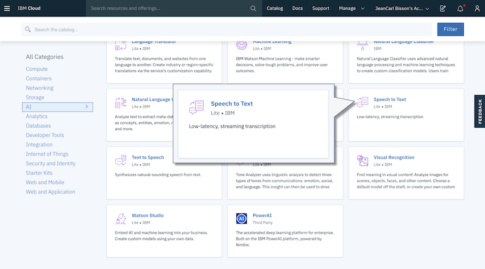
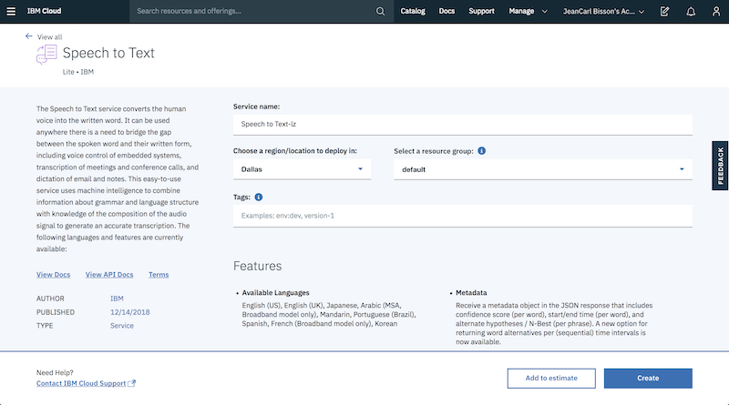
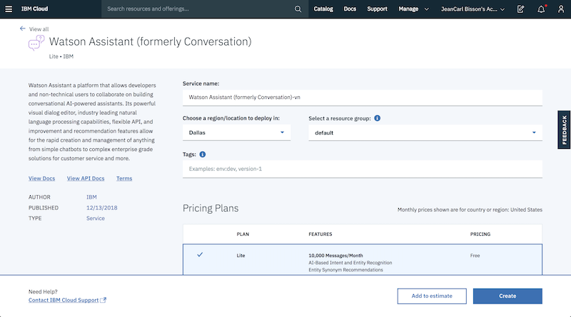
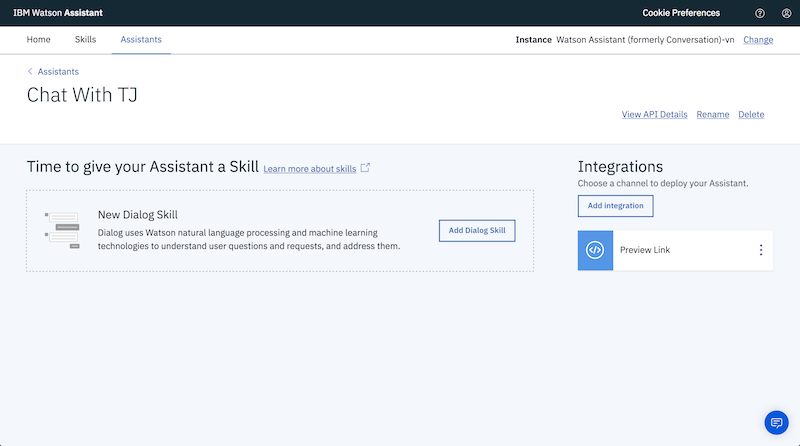
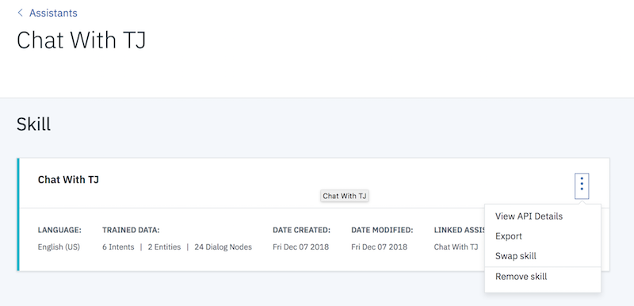
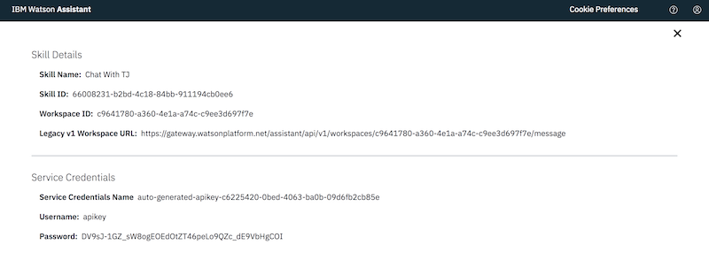

# Conversational Robot


## Requirements

In this lab, we'll use the listen, converse, and speak methods to train TJBot to listen to utterances, understand the natural language intents and entities, and respond by speaking out the response.

You can run this lab on a physical TJBot or use the [TJBot simulator](https://ibm.biz/meet-tjbot).

If you run this lab on a physical TJBot, you will need to connect a microphone and speaker to the TJBot for this lab. There is also an extra step to configure the speaker in the section titled **Running on the Raspberry Pi** at the end of this lab.

## IBM Cloud Account

You will need a IBM Cloud account to create the IBM Watson services used in this lab. Please visit [ibm.biz/start-tjbot-lab](https://ibm.biz/start-tjbot-lab) to register for and log into your IBM Cloud.

## Train TJBot to Listen, Converse, and Speak

1. Create a file named `app.js`. Copy the following code. In the following steps, replace the `/* Step # */` placeholders with the code provided.

    ```
    var TJBot = require("tjbot");
    
    var tj = new TJBot(
      [/* Step #2 *//* Step #23 */],
      {
        /* Step #24 */
      },
      {
        /* Step #8 */
        /* Step #16 */
        /* Step #22 */
      }
    );

    /* Step #17 */

    /* Step #9 */
    ```

2. In order for TJBot to listen and transcribe audio, we first need to configure it with a microphone. The first argument to the TJBot constructor is an array of hardware available. Add `"microphone"` to this array.

    ```
    var tj = new TJBot(
      ["microphone"/* Step #23 */],
    ```

3. TJBot uses the Watson Speech to Text service from IBM Cloud to transcribe the audio. If you don't have an IBM Cloud account, sign up at [https://bluemix.net](https://bluemix.net). Sign into your account.

4. Click on the **Catalog** link in the top right corner of the IBM Cloud dashboard.

    


5. Click on the **Watson** category on the left. Click on the **Speech to Text** tile.

    

6. Leave the service name as is and click **Create**.

    

7. Click on **Service Credentials** in the menu on the left. If there are no credentials in the list, click **New credential** and **Add** to create a set of credentials. Click on **View Credentials** to display the service credentials.

    	    
    	        

8. Replace the placeholder `/* Step #8 */` with the following code. Use your own username and password credentials from the previous step.

    ```
        speech_to_text: {
          username: "cf63b1f3-ef18-4628-86c8-6b1871e076b9",
          password: "MWNwz3qcdIab"
        },
    ```

        

9. Replace the placeholder `/* Step #9 */` with the following code.
This will instruct TJBot to start transcribing what is heard, calling the processText function after each chunk of audio is transcribed. We also call the method `stopListening` to stop any further audio capturing.

    ```    
    function processText(text) {
      console.log(text);
      tj.stopListening();      

      /* Step #18 */
    }

    tj.listen(processText);    
    ```

10. Next, we'll use the Watson Assistant (formerly Watson Conversation) service to analyze the text and respond, which requires service credentials from IBM Cloud. Return to the IBM Cloud dashboard catalog and create a **Watson Assistant (formerly Conversation)** service.

    

11.	Leave the service name as is and click **Create**.

    

12. Click on the green button labeled **Launch Tool** to launch into the Watson Assistant training tool.

    

13. We'll use a pretrained workspace. Download the file [workspace.json](../workspace.json) to your computer. Click on the up arrow to the right of the **Create** button.

    

14. Click **Choose a file** and select the `workspace.json` file you downloaded. Click **Import** to create the new workspace.

        

15. The workspace has been trained with Intents, Entities, and a Dialog of responses that provide a simple conversation that the user can ask TJBot. Explore the tabs and see how an example chatbot is designed in the Watson Assistant service.

        

    In order for TJBot to use the Watson Assistant service, we first need to get the service credentials and workspace ID. Click on the deploy button in the left sidebar.

        

16. Click on the **Credentials** tab. Copy the username and password values. Replace the placeholder `/* Step #16 */` with the following code. Use the **Username** and **Password** credentials.

    
    

    ```
        conversation: {
          username: "0b1a23a4-e56d-7890-bf1d-23e45b6789bf",
          password: "ABCDEfGHiJkL"
        },
    ```

17. Replace the placeholder `/* Step #17 */` with the following code.

    ```
    var workspaceId = "12ea34ee-5bf6-7890-1b2a-34506a596ff";
    ```

    Copy and paste the **Workspace ID** value into this value.

    

18. Replace the placeholder `/* Step #18 */` with the following code. This code will pass the text that was transcribed with the Watson Speech to Text service to the Watson Assistant service to understand and analyze.

    ```  
      tj.converse(workspaceId, text, response => {
        console.log(response);

        /* Step #25 */
      });
    ```

    Here's an example of what the `response` object looks like.

    ```
    {
      "object": {
        "intents": [
          {
            "intent": "what_am_i",
            "confidence": 0.8959802150726319
          }
        ],
        "entities": [],
        "input": {
          "text": "who are you?"
        },
        "output": {
          "text": [
            "I'm T J Bot. I'm an open-source project at IBM that shows you how to enable beautiful objects like me with cognitive capabilities using IBM Watson."
          ],
          "nodes_visited": [
            "node_2_1520404296380"
          ],
          "log_messages": []
        },
        "context": {
          "conversation_id": "7cca5aa8-6906-480c-846b-0c40c35e79a8",
          "system": {
            "dialog_stack": [
              {
                "dialog_node": "root"
              }
            ],
            "dialog_turn_counter": 1,
            "dialog_request_counter": 1,
            "_node_output_map": {
              "node_2_1520404296380": [
                0
              ]
            },
            "branch_exited": true,
            "branch_exited_reason": "completed"
          }
        }
      },
      "description": "I'm T J Bot. I'm a open-source project at IBM that shows you how to enable beautiful objects like me with cognitive capabilities using IBM Watson."
    }
    ```    

19. Finally, we'll use the Watson Text to Speech service to speak out the response, which requires service credentials from IBM Cloud. Return to the IBM Cloud dashboard catalog and create a **Watson Text to Speech** service.

        

20. Leave the service name as is and click **Create**.

    

21. Click on **Service Credentials** in the menu on the left. If there are no credentials in the list, click **New credential** and **Add** to create a set of credentials. Click on **View Credentials** to display the service credentials.

    	    
    	        

22. Replace the placeholder `/* Step #22 */` with the following code. Use your own username and password credentials from the previous step.

    ```
        text_to_speech: {
          username: "dec28251-d359-4f88-a714-9f36694c4218",
          password: "5ZwSwrciqoHG"
        }
    ```

    

23. In order for TJBot to play audio, we need to configure it with a speaker. Add `"speaker"` to the array of the first argument to the TJBot constructor. If you're using a physical TJBot, please refer to the section below titled **Running on the Raspberry Pi** for more information about the speaker device ID.

    ```
    var tj = new TJBot(
      ["microphone","speaker"],
    ```

24. Replace the placeholder `/* Step #24 */` with the following code. Configure TJBot with the gender of the voice (`male` or `female`) and what language to use (`en-US` is for the US English dialect).

    ```
        robot: {
          gender: "male"
        },
        speak: {
          language: "en-US"
        }
    ```

25. Replace the placeholder `/* Step #25 */` with the following code. This code will combine the response from the Watson Assistant service and use the Watson Text to Speech service to speak out the response. When the text has been spoken out, TJBot will resume listening for another utterance, and repeat the cycle.

    ```
        tj.speak(response.object.output.text.join(" ")).then(() => {
          tj.listen(processText);
        });
    ```

26. Run the code. Speak a phrase. TJBot will transcribe the audio with the Watson Speech to Text service, analyze the utterance with the Watson Assistant service, and speak out the response using the Watson Text to Speech service.    


## Running on the Raspberry Pi

Depending on the speaker you use, you may need to specify the speaker device ID. Determine the Speaker Device ID by running the command `aplay -l` on the Raspberry Pi. In the example output shown below, the USB speaker attached is accessible on card `2`, device `0`.


In the TJBot configuration, use the applicable speaker device ID, with the format `plughw:<card>,<device>`

```
    speak: {
      language: "en-US",
      speakerDeviceId: "plughw:2,0"
    }
```

## Completed Code

The completed Node.js program is shown below.

```
var TJBot = require("tjbot");

var tj = new TJBot(
  ["microphone","speaker"],
  {
    robot: {
      gender: "male"
    },
    speak: {
      language: "en-US"
    }
  },
  {
    speech_to_text: {
      username: "",
      password: ""
    },
    conversation: {
      username: "",
      password: ""
    },
    text_to_speech: {
      username: "",
      password: ""
    }    
  }
);

var workspaceId = "";

function processText(text) {
  console.log(text);
  tj.stopListening();

  tj.converse(workspaceId, text, response => {
    console.log(response);

    tj.speak(response.object.output.text.join(" ")).then(() => {
      tj.listen(processText);
    });
  });
}

tj.listen(processText);
```

## IBM Coder Challenge

When you complete this lab, visit the [IBM Coder challenge](https://ibm.biz/ibm-coder-tjbot) to earn credit.
