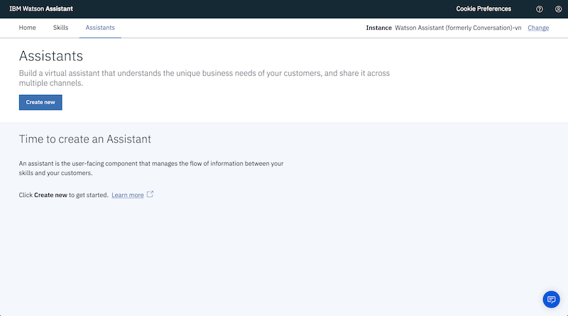
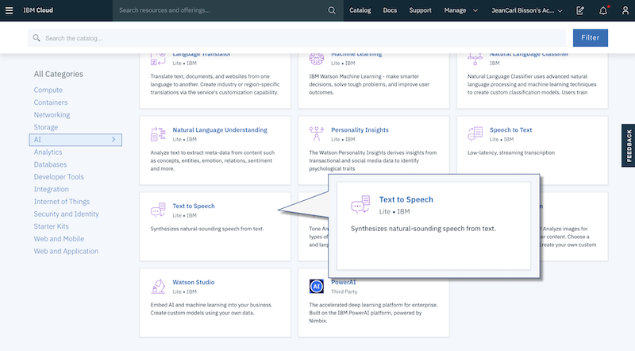

# Lab 3: Create a conversational robot


## Requirements

In this lab, use the listen, converse, and speak methods to train TJBot to listen to utterances, understand the natural language intents and entities, and respond by speaking out the response.

You can run this lab on a physical TJBot or use the [TJBot simulator](https://ibm.biz/meet-tjbot).

If you run this lab on a physical TJBot, you will need to connect a microphone and speaker to the TJBot. There is also an extra step to configure the speaker in the section "[Running on the Raspberry Pi](https://link)" at the end of this lab.

### IBM Cloud Account

You will need an IBM Cloud account to create the IBM Watson services used in this lab. [Sign up](https://ibm.biz/start-tjbot-lab) for or [log in](https://ibm.biz/start-tjbot-lab) to your IBM Cloud.

## 1. Train TJBot to listen, converse, and speak

1. Create a file named `app.js`. Copy the following code: 

    ```
    var TJBot = require("tjbot");
    
    var tj = new TJBot(
      [/* Step #2 *//* Step #23 */],
      {
        /* Step #24 */
      },
      {
        /* Step #8 */
        /* Step #16 */
        /* Step #22 */
      }
    );

    /* Step #17 */

    /* Step #9 */
    ```
    
    In the subsequent steps in this lab, replace the `/* Step # */` placeholders with the code provided. You can check your code against the [completed Node.js program](link).

2. Configure TJBot with a microphone to listen to and to transcribe audio. The first argument to the TJBot constructor is an array of hardware available. Add `"microphone"` to this array.

    ```
    var tj = new TJBot(
      ["microphone"/* Step #23 */],
    ```

3. TJBot uses the Watson Speech to Text service from IBM Cloud to transcribe the audio. [Sign up](https://bluemix.net) for or [log in](https://bluemix.net) to your IBM Cloud.

4. Click the **Catalog** link in the upper-right corner of the IBM Cloud dashboard.

    


5. Click the **Watson** category on the left. Then click the **Speech to Text** tile.

    

6. Leave the service name as is. Click **Create**.

    

7. Click **Service Credentials** in the menu on the left. If there are no credentials in the list, click **New credential** > **Add** to create a set of credentials. Click **View Credentials** to display the service credentials.

    	    
    	        

8. Replace the placeholder `/* Step #8 */` with the following code, using your own username and password credentials from the previous step:

    ```
        speech_to_text: {
          username: "cf63b1f3-ef18-4628-86c8-6b1871e076b9",
          password: "MWNwz3qcdIab"
        },
    ```

        

9. Replace the placeholder `/* Step #9 */` with the following code, which instructs TJBot to start transcribing what is heard, calling the `processText` function after each chunk of audio is transcribed:

    ```    
    function processText(text) {
      console.log(text);
      tj.stopListening();      

      /* Step #18 */
    }

    tj.listen(processText);    
    ```
    
    The method `stopListening` stops any further audio capturing.

10. Return to the IBM Cloud dashboard catalog and create a **Watson Assistant (formerly Conversation)** service, which you will use to analyze the text and respond. 

    

11.	Leave the service name as is. Click **Create**.

    

12. Click **Launch Tool** to open the Watson Assistant training tool.

    

13. To use a pretrained workspace, [download](../workspace.json) the workspace.json file to your computer. 

14. Click the **Import** icon (to the right of the Create button). 

    
    
    Select the workspace.json file you downloaded, and then click **Import**.
        

15. The workspace has been trained with intents, entities, and a dialog of responses that provide a simple conversation that the user can ask TJBot. Explore the tabs and see how an example chatbot is designed in the Watson Assistant service.

        

    For TJBot to use the Watson Assistant service, you first need to get the service credentials and workspace ID. 
    
    Click the **Deploy** toolbar button.

        

16. Click the **Credentials** tab, and copy the username and password values.

    
    
    Then replace the placeholder `/* Step #16 */` with the following code, using the username and password credentials:
    ```
        conversation: {
          username: "0b1a23a4-e56d-7890-bf1d-23e45b6789bf",
          password: "ABCDEfGHiJkL"
        },
    ```

17. Replace the placeholder `/* Step #17 */` with the following code, using the Workspace ID credential:

    ```
    var workspaceId = "12ea34ee-5bf6-7890-1b2a-34506a596ff";
    ```

    

18. Replace the placeholder `/* Step #18 */` with the following code, which passes the text that was transcribed with the Watson Speech to Text service to the Watson Assistant service to understand and analyze:

    ```  
      tj.converse(workspaceId, text, response => {
        console.log(response);

        /* Step #25 */
      });
    ```

    Here's an example of what the `response` object looks like:

    ```
    {
      "object": {
        "intents": [
          {
            "intent": "what_am_i",
            "confidence": 0.8959802150726319
          }
        ],
        "entities": [],
        "input": {
          "text": "who are you?"
        },
        "output": {
          "text": [
            "I'm T J Bot. I'm an open-source project at IBM that shows you how to enable beautiful objects like me with cognitive capabilities using IBM Watson."
          ],
          "nodes_visited": [
            "node_2_1520404296380"
          ],
          "log_messages": []
        },
        "context": {
          "conversation_id": "7cca5aa8-6906-480c-846b-0c40c35e79a8",
          "system": {
            "dialog_stack": [
              {
                "dialog_node": "root"
              }
            ],
            "dialog_turn_counter": 1,
            "dialog_request_counter": 1,
            "_node_output_map": {
              "node_2_1520404296380": [
                0
              ]
            },
            "branch_exited": true,
            "branch_exited_reason": "completed"
          }
        }
      },
      "description": "I'm T J Bot. I'm a open-source project at IBM that shows you how to enable beautiful objects like me with cognitive capabilities using IBM Watson."
    }
    ```    

19. Return to the IBM Cloud dashboard catalog and create a **Watson Text to Speech** service, which you will use to speak out the response.

        

20. Leave the service name as is. Click **Create**.

    

21. Click **Service Credentials** in the menu on the left. If there are no credentials in the list, click **New credential** > **Add** to create a set of credentials. Click **View Credentials** to display the service credentials.

    	    
    	        

22. Replace the placeholder `/* Step #22 */` with the following code, using your own username and password credentials from the previous step:

    ```
        text_to_speech: {
          username: "dec28251-d359-4f88-a714-9f36694c4218",
          password: "5ZwSwrciqoHG"
        }
    ```

    

23. To configure TJBot with a speaker to play audio, add `"speaker"` to the array of the first argument to the TJBot constructor. If you're using a physical TJBot, refer to the "[Running on the Raspberry Pi](link)" section for more information about the speaker device ID.

    ```
    var tj = new TJBot(
      ["microphone","speaker"],
    ```

24. Replace the placeholder `/* Step #24 */` with the following code to configure TJBot with the gender of the voice (`male` or `female`) and what language to use (`en-US` is for the US English dialect):

    ```
        robot: {
          gender: "male"
        },
        speak: {
          language: "en-US"
        }
    ```

25. Replace the placeholder `/* Step #25 */` with the following code, which combines the response from the Watson Assistant service and uses the Watson Text to Speech service to speak out the response:

    ```
        tj.speak(response.object.output.text.join(" ")).then(() => {
          tj.listen(processText);
        });
    ```
    
    When the text has been spoken out, TJBot will resume listening for another utterance, and repeat the cycle.

26. Run the code. Speak a phrase. TJBot will transcribe the audio with the Watson Speech to Text service, analyze the utterance with the Watson Assistant service, and speak out the response using the Watson Text to Speech service.    


## Running on the Raspberry Pi

Depending on the speaker you use, you may need to specify the speaker device ID. Determine the Speaker Device ID by running the command `aplay -l` on the Raspberry Pi. In the example output shown below, the USB speaker attached is accessible on card `2`, device `0`.


In the TJBot configuration, use the applicable speaker device ID, with the format `plughw:<card>,<device>`.

```
    speak: {
      language: "en-US",
      speakerDeviceId: "plughw:2,0"
    }
```

## Completed code

The following is completed Node.js program:

```
var TJBot = require("tjbot");

var tj = new TJBot(
  ["microphone","speaker"],
  {
    robot: {
      gender: "male"
    },
    speak: {
      language: "en-US"
    }
  },
  {
    speech_to_text: {
      username: "",
      password: ""
    },
    conversation: {
      username: "",
      password: ""
    },
    text_to_speech: {
      username: "",
      password: ""
    }    
  }
);

var workspaceId = "";

function processText(text) {
  console.log(text);
  tj.stopListening();

  tj.converse(workspaceId, text, response => {
    console.log(response);

    tj.speak(response.object.output.text.join(" ")).then(() => {
      tj.listen(processText);
    });
  });
}

tj.listen(processText);
```

## IBM Coder Challenge

When you complete this lab, visit the [IBM Coder challenge](https://ibm.biz/ibm-coder-tjbot) to earn credit.
