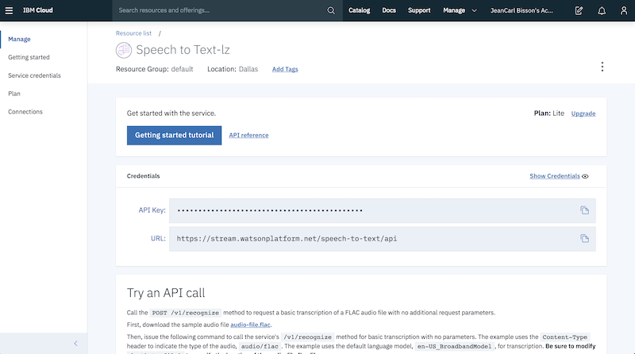
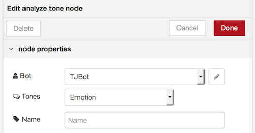
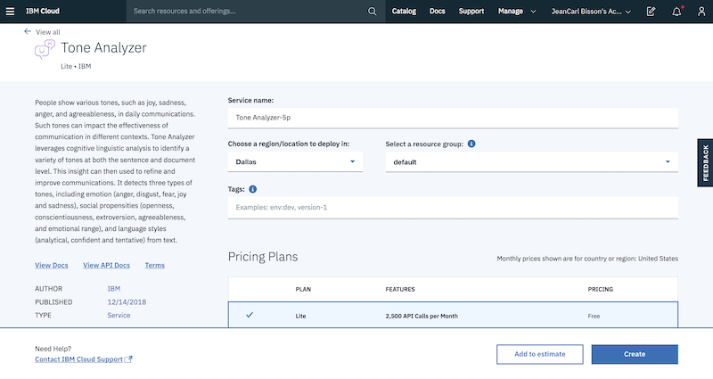
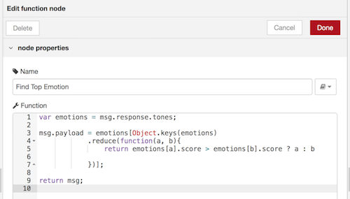
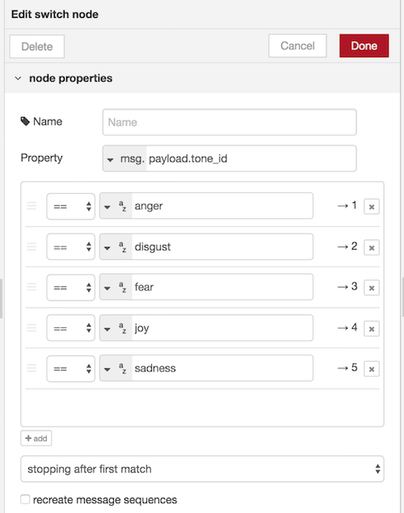
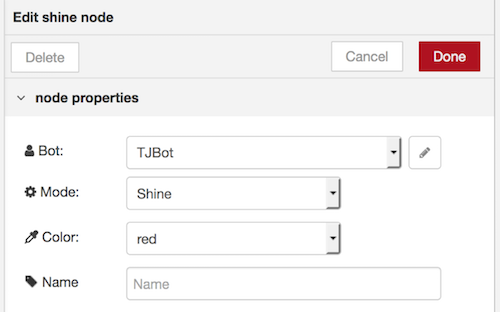
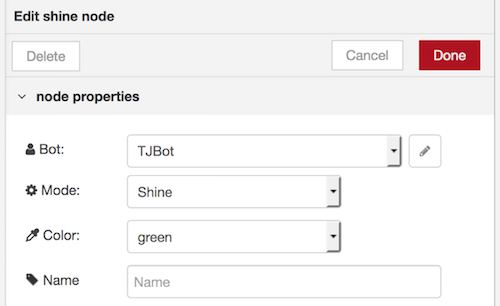
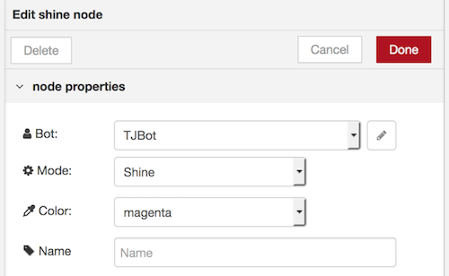
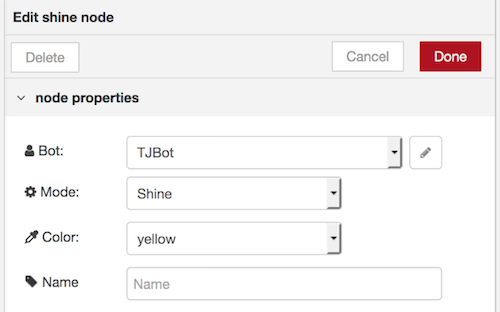
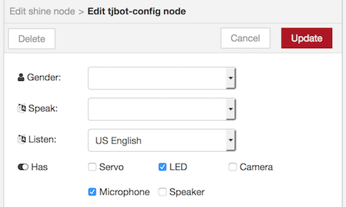

# Emotional LED Light

## Requirements

In this lab, you'll use the listen and analyze tone nodes to train TJBot to listen to utterances and analyze the emotion, lighting up an LED light based on which emotion is most prevalent. You will need a microphone and LED connected to the TJBot for this lab.

## Train TJBot to Listen and React to Emotions

1. In the Node-RED editor running on the Raspberry Pi, drag two  nodes onto the canvas. Double click each node and configure as shown below.

    
    
    
 
2. Add a  node as shown below. This node will take the payload from the inject nodes and set the `msg.mode` property, which the listen node in the next step will use.

    
3. Add a  node as shown below. The listen node has several modes, start and stop, that can be configured programmatically using the `msg.mode` property to start and stop listening. When listening is enabled, the listen node produces messages as TJBot hears and transcribes words, with the text being passed in the `msg.payload` property. 

    The listen node uses the Watson Speech to Text service, which requires service credentials from IBM Cloud. Click the pencil icon to the right of the **Bot** dropdown menu.

    

4. Click the link icon next to the **Speech to Text** heading to launch into the IBM Cloud console. Sign into your IBM Cloud account if prompted. 

    

5. Leave the service name as is. Click **Create**.

    

6. Click **Show Credentials**.

    

7. Copy the API Key into the field back in the Node-RED editor under the **Speech to Text** section.

    
        

8. At the top of the configuration window, select **US English** from the **Listen** dropdown menu. Enable the microphone by ticking the checkbox labeled **Microphone**.

    

9. Add a  node as shown below. Select **Emotion** from the **Tones** dropdown menu.

    The analyze node uses the Watson Tone Analyzer service, which requires service credentials from IBM Cloud. Click the pencil icon to the right of the **Bot** dropdown menu. 

    

10. Click the link icon next to the **Tone Analyzer** heading to launch into the IBM Cloud console and create a Watson Tone Analyzer service instance.

    

11. Leave the service name as is. Click **Create**.

    

12. Click **Show Credentials**.

    

13. Copy the API Key into the field back in the Node-RED editor under the **Tone Analyzer** section.

    
        
14. Watson Tone Analyzer returns scores for five emotions: anger, disgust, fear, joy, and sadness. Use a  node to find the emotion that scores the highest.

    

15. Add a  node to test which emotion scored highest as shown below.

    
16. Add five shine nodes, each with a color representing one of the emotions: red (anger), green (disgust), magenta (fear), yellow (joy), and blue (sadness).

     
     
     
    
    

17. The shine node uses the LED. Click the pencil icon to the right of the **Bot** dropdown menu. At the top of the configuration window, enable the LED by ticking the checkbox labeled **LED**.

     
    
18. Connect the nodes together as shown below.

     
    
19. Click the  button in the top-right corner of the Node-RED editor to save and deploy the changes.

20. Click the button to the left of the inject node labeled **Start Listening** to activate the microphone. Speak into the microphone and wait for the LED to turn the color that represents the emotion that's most prevalent. Click the button to the left of the inject node labeled **Stop Listening** to deactivate the microphone.

## Notes

This lab uses the TJBot Node.js library which uses an older version of the Tone Analyzer. As of September 25th 2017 (service version: 3.4.1, interface version: 2017-09-21), the Tone Analyzer service no longer returns the emotion disgust. 