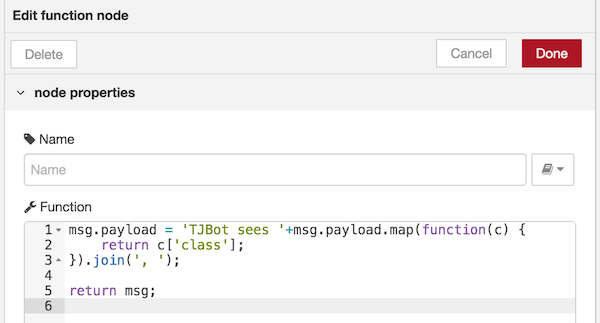
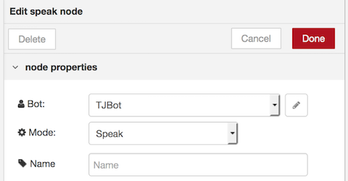

# Lab 2: Say what I see

## Requirements

In this lab, use the see and speak nodes to train TJBot to recognize objects and speak what is seen. You will need a Raspberry Pi camera and speaker connected to the TJBot for this lab. 

## Train TJBot to see objects and to speak

1. In the Node-RED editor running on the Raspberry Pi, drag an inject node () onto the canvas. 

2. Double-click the node and configure it, as shown below:

    

3. Add a see node (), and edit it.

   a. The see node has several modes: recognize text, recognize objects, and take a photo. Select **See (identify objects)** from the **Mode** drop-down list.

   b. The see node uses the Watson Visual Recognition service, which requires service credentials from IBM Cloud. Click on the pencil icon to the right of the **Bot** drop-down list. 

    

4. Click on the link icon next to the "Visual Recognition" heading to open the IBM Cloud console and create a Watson Visual Recognition service instance.

    
    
5. [Sign up](https://bluemix.net) for or [log in](https://bluemix.net) to IBM Cloud, if prompted. 

6. Leave the service name as is, and click **Create**.

    

7. Click **Service Credentials** in the menu on the left. If there are no credentials in the list, click **New credential** > **Add** to create a set of credentials. Click **View Credentials** to display the service credentials.

    	
    

8. Copy the API key into the **Visual Recognition** section of the Node-RED editor.

    
    
	
9. select the **Camera** checkbox to enable the camera.

    

10. The see node produces a message with names of objects and colors in the photo analyzed, with the response being passed in the `msg.payload` property. Add a function node () to loop through the results and concatenate them into a new message.

    

11. Add a speak node (). 

12. The speak node uses the Watson Text to Speech service, which requires service credentials from IBM Cloud. Click on the pencil icon to the right of the **Bot** drop-down list. 

    

13. Click on the link icon next to the "Text to Speech" heading to open the IBM Cloud console and create a Watson Text to Speech service instance.

    

14. Leave the service name as is, and click **Create**.

    

15. Click **Service Credentials** in the menu on the left. If there are no credentials in the list, click **New credential** > **Add** to create a set of credentials. Click **View Credentials** to display the service credentials.

    	
        

16. Copy the username and password into the **Text to Speech** section of the Node-RED editor.

    
    
    
17. Determine the Speaker Device ID by running the command `aplay -l` on the Raspberry Pi. In the example output shown below, the USB speaker attached is accessible on card `2`, device `0`.

    

18. In the TJBot configuration, enter the applicable speaker device ID, with the format `plughw:<card>,<device>`.

    

19. At the top of the configuration window:
    a. Select **English (US dialect)** from the **Speak** drop-down list. 
    b. Select the **Speaker** checkbox to enable the speaker.
 
    

20. Connect the nodes together, as shown below:

    

21. Click the **Deploy** button () in the upper right corner of the Node-RED editor to save and deploy the changes.

22. Click the tab to the left of the inject node to take a picture with TJBot's camera. 

    When the photo is analyzed with the Watson Visual Recognition service, a message is constructed with the objects and colors recognized, and is spoken out using the speaker.

    An example is:

    `TJBot sees earphone, person, face, people, maroon color`
