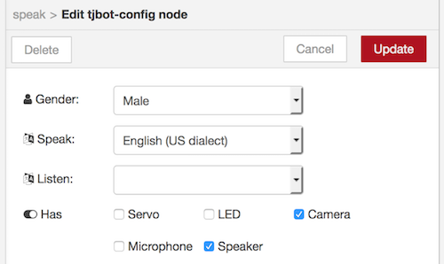

# Say What I See

## Requirements

In this lab, you'll use the see and speak nodes to train TJBot to recognize objects and speak out loud what is seen. You will need a Raspberry Pi camera and speaker connected to the TJBot for this lab. 

## Train TJBot to See Objects and Speak

1. In the Node-RED editor running on the Raspberry Pi, drag an  node onto the canvas. Double click the node and configure as shown below.

    

2. Add a  node as shown below. The see node has several modes: recognize text, recognize objects, and take a photo. Select **See (identify objects)** from the **Mode** dropdown menu.

    
    
    The see node uses the Watson Visual Recognition service, which requires service credentials from IBM Cloud. Click the pencil icon to the right of the **Bot** dropdown menu. 

3. Click the link icon next to the **Visual Recognition** heading to launch into the IBM Cloud console. Sign into your IBM Cloud account if prompted. 

    
4. Leave the service name as is. Click **Create**.

    

5. Click **Show Credentials**.

    	

6. Copy the API key into the field back in the Node-RED editor under the **Visual Recognition** section. 

    
        
	
7. Enable the camera by ticking the checkbox labeled **Camera**. 

    

8.	The see node produces a message with names of objects and colors in the photo analyzed, with the response being passed in the `msg.payload` property. Add a  node to loop through the results and concatenate them into a new message.

    

9.	Add a  node as shown below. The speak node uses the Watson Text to Speech service, which requires service credentials from IBM Cloud. Click the pencil icon to the right of the **Bot** dropdown menu. 

    

10.	Click the link icon next to the **Text to Speech** heading to launch into the IBM Cloud console and create a Watson Text to Speech service instance.

    

11.	Leave the service name as is. Click **Create**.

    

12.	Click **Show Credentials**.

    	

13.	Copy the API key into the field back in the Node-RED editor under the **Text to Speech** section.

        

    
14.	Determine the Speaker Device ID by running the command `aplay -l` on the Raspberry Pi. In the example output shown below, the USB speaker attached is accessible on card `2`, device `0`.

    

    In the TJBot configuration, enter the applicable speaker device ID, with the format `plughw:<card>,<device>`

    

15. At the top of the configuration window, select **Male** or **Female** from the **Gender** dropdown menu. Select **English (US dialect)** from the **Speak** dropdown menu. Enable the speaker by ticking the checkbox labeled **Speaker**. 
 
    

16.	Connect the nodes together as shown below.

    

17.	Click the  button in the top-right corner of the Node-RED editor to save and deploy the changes.

18.	Click the tab to the left of the inject node to take a picture with TJBot's camera. When the photo is analyzed with the Watson Visual Recognition service, a message is constructed with the objects and colors recognized, and is spoken out via the speaker.

    An example is:

    `TJBot sees earphone, person, face, people, maroon color`
