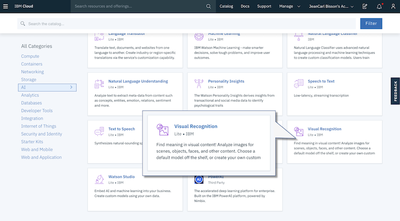
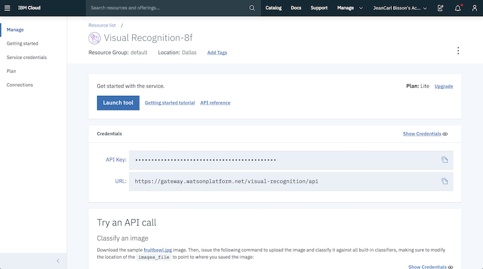
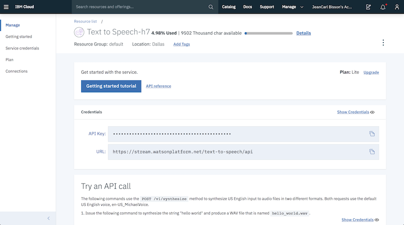

# Lab 2: Say what I see


## Requirements

In this lab, use the see and speak capabilities to train TJBot to recognize objects and to speak what is seen. 

You can run this lab on a physical TJBot or use the [TJBot simulator](https://ibm.biz/meet-tjbot).

If you run this lab on a physical TJBot, you will need to connect a Raspberry Pi camera and speaker to the TJBot. There is also an extra step to configure the speaker in the section "[Running on the Raspberry Pi](https://link)" at the end of this lab.

### IBM Cloud Account

You will need an IBM Cloud account to create the IBM Watson services used in this lab. [Sign up](https://ibm.biz/start-tjbot-lab) for or [log in](https://ibm.biz/start-tjbot-lab) to IBM Cloud.

## Train TJBot to See Objects and Speak

1. Create a file named app.js. Copy the following code: 

    ```
    var TJBot = require("tjbot");
    
    var tj = new TJBot(
      [/* Step #2 *//* Step #16 */], 
      {
        /* Step #15 */
      }, 
      {
        /* Step #8 */
        /* Step #14 */
      });
        
    /* Step #9 */
    ```
    
    In the subsequent steps in this lab, replace the `/* Step # */` placeholders with the code provided. You can check your code against the [completed Node.js program](link).
    
2. Configure TJBot with a camera to be able to take a picture. The first argument to the TJBot constructor is an array of hardware available. Add `"camera"` to this array.

    ```
    var tj = new TJBot(
      ["camera"],
    ```

3. TJBot uses the Watson Visual Recognition service from IBM Cloud to classify objects and colors in the picture. [Sign up](https://bluemix.net) for or [log in](https://bluemix.net) to IBM Cloud.

4. Click the **Catalog** link in the upper right corner of the IBM Cloud dashboard. 

    
    

5. Click the **Watson** category on the left. Then click the **Visual Recognition** tile.

    

6. Leave the service name as is, and click **Create**.

    

7. Click **Service Credentials** in the menu on the left. If there are no credentials in the list, click **New credential** > **Add** to create a set of credentials. Click **View Credentials** to display the service credentials.

    	    
    	        

8. Replace the placeholder `/* Step #8 */` with the following code, using your own API key from the previous step:

    ```
      visual_recognition: {
        api_key: "g0h123kjf5h3m620n5h1175mrk54h32vc54ji543"
      },   
    ```
    
        

9. Replace the placeholder `/* Step #9 */` with the following code, which instruct TJBot to take a photo and return an array of objects and colors:
    
    ```    
    tj.see(objects => {
      console.log(objects);
          
      /* Step #10 */
          
      /* Step #17 */
    });    
    ```

    The `see` method produces an array with names of objects and colors in the photo analyzed. Here's what an example response looks like:

    ```
    [
      {
        "class": "person",
        "score": 0.865
      },
      {
        "class": "indigo color",
        "score": 0.613
      },
      {
        "class": "gray color",
        "score": 0.576
      }
    ]
    ```

10. Replace the placeholder `/* Step #10 */` with the following code that loops through this result and concatenates the items into one string:
    
    ```
      var text = "T J Bot sees " + objects.map(item => item["class"]).join(", ");
      console.log(text);
    ```

11. Next, we'll train TJBot to speak out this string using the Watson Text to Speech service, which requires service credentials from IBM Cloud. Return to the IBM Cloud dashboard catalog and create a **Text to Speech Watson** service.

12.	Leave the service name as is, and click **Create**.

    

13.	Click **Service Credentials** in the menu on the left. If there are no credentials in the list, click **New credential** > **Add** to create a set of credentials. Click **View Credentials** to display the service credentials.

    	
        

14. Replace the placeholder `/* Step #14 */` with the following code, using your own username and password credentials from the previous step:

    ```
    text_to_speech: {
      username: "f8b532e1-4151-4993-92ee-89bc5a23890c",
      password: "f4G1M3B5onrP"
    }
    ```

       

15. Replace the placeholder `/* Step #15 */` with the following code to configure TJBot with the gender of the voice (`male` or `female`) and what language to use (`en-US` is for the US English dialect): 

    ```
    robot: {
      gender: "male" 
    },
    speak: {
      language: "en-US" 
    }
    ```     

16. To configure TJBot with a speaker to play audio, add `"speaker"` to the array of the first argument to the TJBot constructor. If you're using a physical TJBot, refer to the "[Running on the Raspberry Pi](link)" section for more information about the speaker device ID.

    ```
    var tj = new TJBot(
      ["camera","speaker"], 
    ```
    
17. Replace the placeholder `/* Step #17 */` with the following code, which instructs TJBot to speak out the value of the variable text (the concatenated list of objects and colors it sees):

    ```
      tj.speak(text);
    ```

18. Run the code. When a photo is taken, it is analyzed with the Watson Visual Recognition service, a message is constructed with the objects and colors recognized, and it is spoken out using the speaker.

    An example is:

    `TJBot sees earphone, person, face, people, maroon color`

## Running on the Raspberry Pi

Depending on the speaker you use, you may need to specify the speaker device ID. Determine the Speaker Device ID by running the command `aplay -l` on the Raspberry Pi. In the example output shown below, the USB speaker attached is accessible on card `2`, device `0`.


In the TJBot configuration, use the applicable speaker device ID, with the format `plughw:<card>,<device>`

```
    speak: {
      language: "en-US",
      speakerDeviceId: "plughw:2,0" 
    }
```

## Completed code

The following is the completed Node.js program:

```
var TJBot = require("tjbot");

var tj = new TJBot(
  ["camera","speaker"], 
  {
    robot: {
      gender: "male" 
    },
    speak: {
      language: "en-US"
    }
  }, 
  {
    visual_recognition: {
      api_key: ""
    },
    text_to_speech: {
      username: "",
      password: ""
    }
  });
    
tj.see(objects => {
  console.log(objects);
  
  var text = "T J Bot sees " + objects.map(item => item["class"]).join(", ");
  console.log(text);
  
  tj.speak(text);
});
```

## IBM Coder challenge

When you complete this lab, visit the [IBM Coder challenge](https://ibm.biz/ibm-coder-tjbot) to earn credit.
