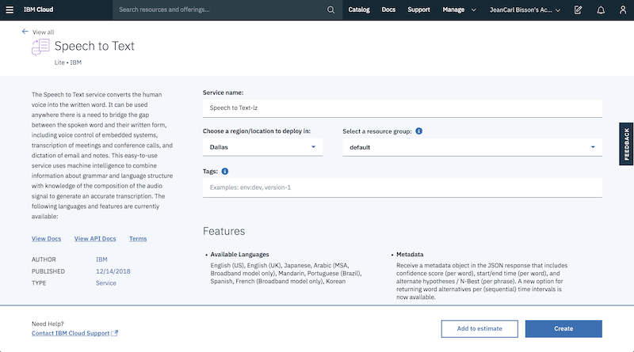
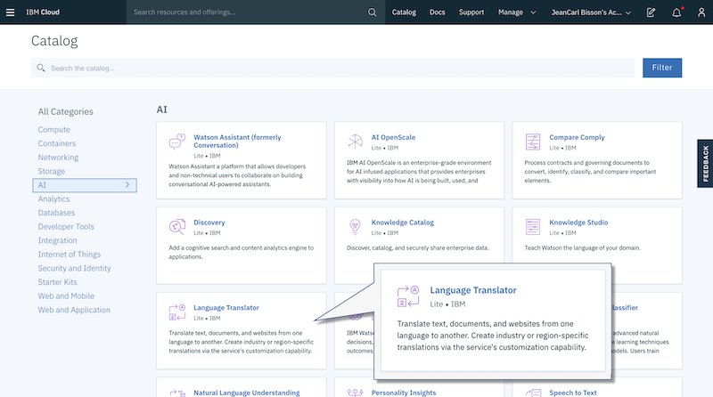
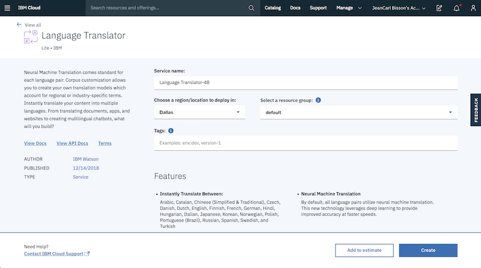
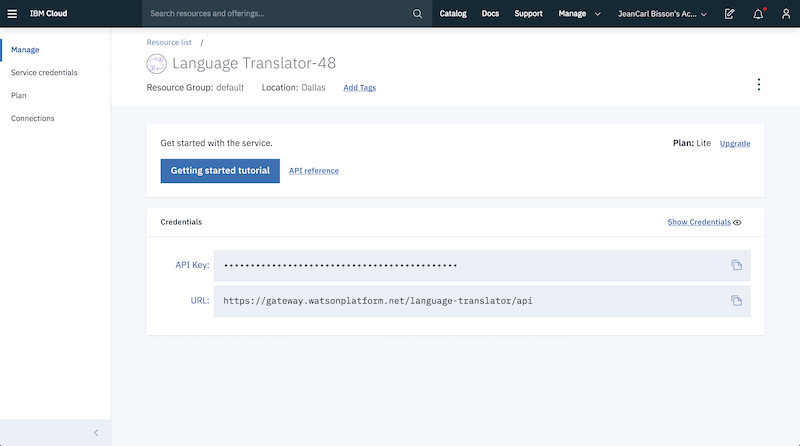
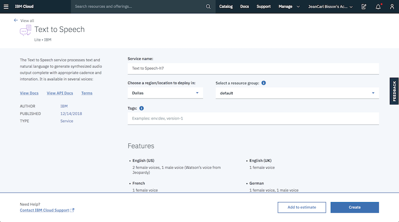
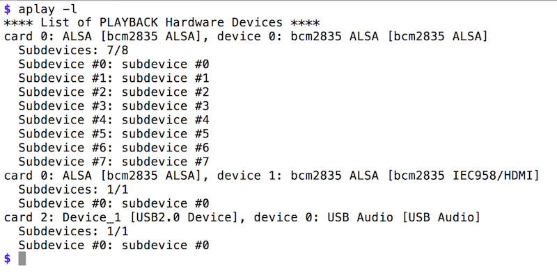

# Translate what I hear


## Requirements

In this lab, you'll use the listen, translate, and speak methods to train TJBot to listen to utterances, translate to French, and speak out loud the translation.

You can run this lab on a physical TJBot or use the [TJBot simulator](https://ibm.biz/meet-tjbot).

If you run this lab on a physical TJBot, you need to connect a microphone and speaker to the TJBot. 

## IBM Cloud account

You will need a IBM Cloud account to create the IBM Watson services used in this lab. See [ibm.biz/start-tjbot-lab](https://ibm.biz/start-tjbot-lab) to register for and log into IBM Cloud.

## Train TJBot to listen and translate

1. Create a file named app.js. Copy the following code. In the following steps, replace the `/* Step # */` placeholders with the code provided. 

    ```
    var TJBot = require("tjbot");
    
    var tj = new TJBot(
      [/* Step #2 *//* Step #19 */],
      {
        /* Step #18 */
      },
      {
        /* Step #7 */
        /* Step #12 */
        /* Step #17 */
      }
    );
    
    /* Step #8 */
    ```
    
2. For TJBot to listen and transcribe audio, configure it with a microphone. The first argument to the TJBot constructor is an array of hardware available. Add `"microphone"` to this array.

    ```
    var tj = new TJBot(
      ["microphone"],
    ```

TJBot uses the Watson Speech to Text service from IBM Cloud to transcribe the audio. Sign into your account. 

3. Log in to IBM Cloud and click **Catalog**. 

    

4. Click the **Watson** category on the left and click the **Speech to Text** tile.

    

5. Leave the service name as is and click **Create**.

    

6. Click **Service Credentials** in the menu on the left. If there are no credentials in the list, click **New credential** and  then click **Add** to create a set of credentials. Click **View Credentials** to view the service credentials.

    	    
    	        

7. Replace the placeholder `/* Step #7 */` with the following code. Use your own username and password credentials from the previous step. 

    ```
        speech_to_text: { 
          username: "cf63b1f3-ef18-4628-86c8-6b1871e076b9",
          password: "MWNwz3qcdIab"
        }, 
    ```
    
        

8. Replace the placeholder `/* Step #8 */` with the following code. 
This code instructs TJBot to start transcribing what is heard and call this function after the first chunk of audio is transcribed.
    
    ```    
    tj.listen(text => {
      tj.stopListening();
      /* Step #13 */
    });
    ```

Next, you will train TJBot to translate the text using the Watson Language Translator service, which requires service credentials from IBM Cloud. 

9. Return to the IBM Cloud dashboard catalog. Click the **Watson** category and then click the **Watson Language Translator** tile.

    

10. Leave the service name as is and click **Create**.

    

11. Click **Service Credentials**. If there are no credentials in the list, click **New credential** and then click **Add** to create a set of credentials. Click **View Credentials** to view the service credentials.

    	
        

12. Replace the placeholder `/* Step #12 */` with the following code. Use your own username and password credentials from the previous step. 

    ```
      language_translator: {
        "username": "6853aacd-963e-49ea-a911-3241521d7c03",
        "password": "Nt2xiUbcOUeR"
      },
    ```

       

13. Replace the placeholder `/* Step #13 */` with the following code. This code translates the text from English (en) to French (fr).

    ```
      tj.translate(text, "en", "fr")
        .then((response) => {
          /* Step #20 */
        });
    ```     

Next, you will train TJBot to speak this translation by using the Watson Text to Speech service, which requires service credentials from IBM Cloud. 

14. Return to the IBM Cloud dashboard catalog. Click **Watson > Watson Text to Speech**.

    
    
15. Leave the service name as is and click **Create**.

    

16. Click **Service Credentials > View Credentials** to display the service credentials.

    	
        

17. Replace the placeholder `/* Step #17 */` with the following code. Use your own username and password credentials from the previous step. 

    ```
    text_to_speech: {
      username: "dec28251-d359-4f88-a714-9f36694c4218",
      password: "5ZwSwrciqoHG"
    }
    ```

       

18. Replace the placeholder `/* Step #18 */` with the following code. Configure TJBot with the gender of the voice (`male` or `female`) and what language to use (`fr-FR` is the language code for French). In this example, you'll use the French feminine voice model to synthesize the translation.

    ```
        robot: {
          gender: "female"
        },
        speak: {
          language: "fr-FR"
        }
    ```     

For TJBot to play audio, you need to configure it with a speaker. 

19. Add `"speaker"` to the array of the first argument to the TJBot constructor. If you're using a physical TJBot, see the section below "Running on the Raspberry Pi" for more information about the speaker device ID.

    ```
    var tj = new TJBot(
      ["microphone","speaker"], 
    ```
    
20. Replace the placeholder `/* Step #21 */` with the following code. This will instruct TJBot to speak out loud the translation returned from the Watson Language Translator service.

    ```
          tj.speak(response.translations[0].translation);
    ```

21. Run the code. Speak a phrase, such as `Hello`. TJBot will transcribe the utterance captured via the microphone by using the Watson Speech to Text service, translate the phrase by using the Watson Language Translator service, and then speak out the translation by using the Watson Text to Speech service through the speaker.

    An example translation is:

    `Bonjour`

## Running on the Raspberry Pi

Depending on the speaker you use, you might need to specify the speaker device ID. Determine the Speaker Device ID by running the command `aplay -l` on the Raspberry Pi. In the following example output, the USB speaker attached is accessible on card `2`, device `0`.


In the TJBot configuration, use the applicable speaker device ID, with the format `plughw:<card>,<device>`

```
    speak: {
      language: "fr-FR",
      speakerDeviceId: "plughw:2,0" 
    }
```

## Complete code

See the following complete Node.js program. The Watson service credentials are not shown. 

```
var TJBot = require("tjbot");

var tj = new TJBot(
  ["microphone","speaker"],
  {
    robot: {
      gender: "female"
    },
    speak: {
      language: "fr-FR"
    }
  },
  {
    speech_to_text: {
      "username": "",
	  "password": ""
    },
    language_translator: {
      "username": "",
      "password": ""
    },
    text_to_speech: {
      username: "",
      password: ""
    }    
  }
);

tj.listen(text => {
  tj.stopListening();
  tj.translate(text, "en", "fr")
    .then((response) => {
      tj.speak(response.translations[0].translation);
    });
});
```
